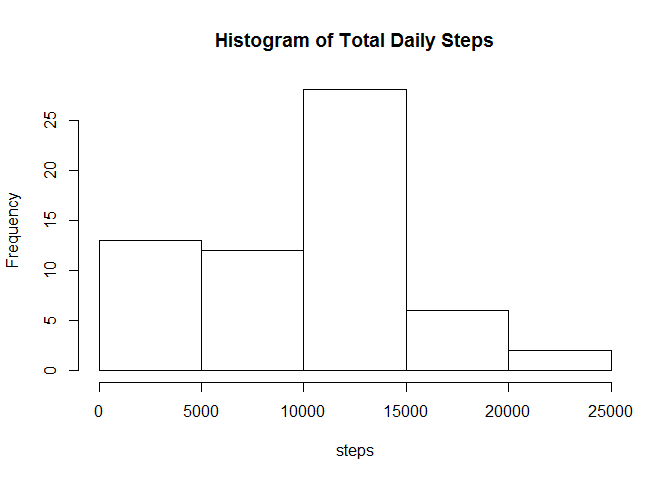
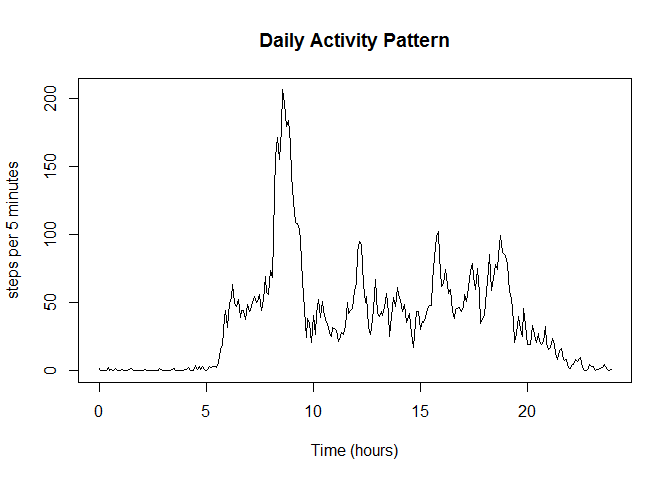
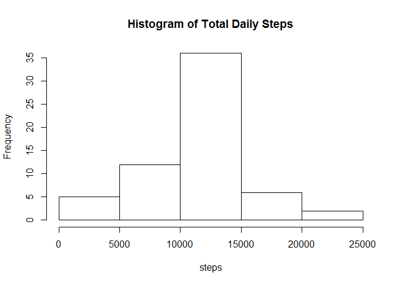
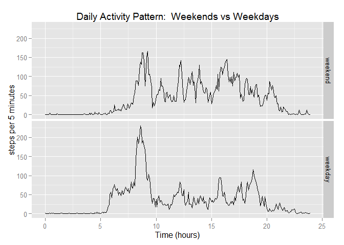

# Reproducible Research: Peer Assessment 1

```r
library(plyr)
library(dplyr)
```

```
## 
## Attaching package: 'dplyr'
```

```
## The following objects are masked from 'package:plyr':
## 
##     arrange, count, desc, failwith, id, mutate, rename, summarise,
##     summarize
```

```
## The following objects are masked from 'package:stats':
## 
##     filter, lag
```

```
## The following objects are masked from 'package:base':
## 
##     intersect, setdiff, setequal, union
```

```r
library(ggplot2)
```

## read in data

```r
unzip("activity.zip")
data <-read.csv("activity.csv")

byday <- group_by(data,date)
stepsbyday <-dplyr::summarise(byday,steps = sum(steps,na.rm=TRUE))
```

## plot histogram of total number of steps taken each day

```r
hist(stepsbyday$steps,main = "Histogram of Total Daily Steps",xlab ="steps")
```

\

## Mean and median number of steps taken each day

```r
mean(stepsbyday$steps)
```

```
## [1] 9354.23
```

```r
median(stepsbyday$steps)
```

```
## [1] 10395
```


```r
byinterval <- group_by(data,interval)
stepsbyinterval <- dplyr::summarise(byinterval,AvgSteps = mean(steps,na.rm=TRUE))
```
### convert intervals into a time in hours (after midnight) for plotting purposes

```r
stepsbyinterval <- dplyr::mutate(stepsbyinterval, time = floor(interval/100)+(interval-100*floor(interval/100))/60)
```

## Time series plot of the average number of steps taken

```r
plot(stepsbyinterval$time,stepsbyinterval$AvgSteps,type="l",main="Daily Activity Pattern",xlab="Time (hours)",ylab="steps per 5 minutes")
```

\

## The 5-minute interval that, on average, contains the maximum number of steps

```r
stepsbyinterval$interval[which.max(stepsbyinterval$AvgSteps)]
```

```
## [1] 835
```

## Code to describe and show a strategy for imputing missing data

```r
sum(!complete.cases(data))
```

```
## [1] 2304
```


```r
missing <- data[!complete.cases(data),]
missingVals <- join(missing,stepsbyinterval,by="interval")
data2 <- data
data2[!complete.cases(data),"steps"] <- missingVals$AvgSteps
```

## Histogram of the total number of steps taken each day after missing values are imputed

```r
byday2 <- group_by(data2,date)
stepsbyday2 <-dplyr::summarise(byday2,steps = sum(steps,na.rm=TRUE))
hist(stepsbyday2$steps,main = "Histogram of Total Daily Steps",xlab ="steps")
```

\


```r
mean(stepsbyday2$steps)
```

```
## [1] 10766.19
```

```r
median(stepsbyday2$steps)
```

```
## [1] 10766.19
```

## Panel plot comparing the average number of steps taken per 5-minute interval across weekdays and weekends

```r
data2 <- mutate(data2, wday = factor(as.POSIXlt(date)$wday))
levels(data2$wday) <- c("weekend","weekday","weekday","weekday","weekday","weekday","weekend")
byinterval2 <- group_by(data2,interval,wday)
stepsbyinterval2 <- dplyr::summarise(byinterval2,AvgSteps = mean(steps,na.rm=TRUE))
stepsbyinterval2 <- dplyr::mutate(stepsbyinterval2, time = floor(interval/100)+(interval-100*floor(interval/100))/60)
plot <-ggplot(data=stepsbyinterval2, aes(x=time, y=AvgSteps))+ #plot steps against time
  geom_line(stat="identity")+  #using line
  facet_grid(wday~.)+ #splitting up into weekends and weekdays
  ylab("steps per 5 minutes")+  
  xlab("Time (hours)")+
  ggtitle("Daily Activity Pattern:  Weekends vs Weekdays") 
print(plot)
```

\
